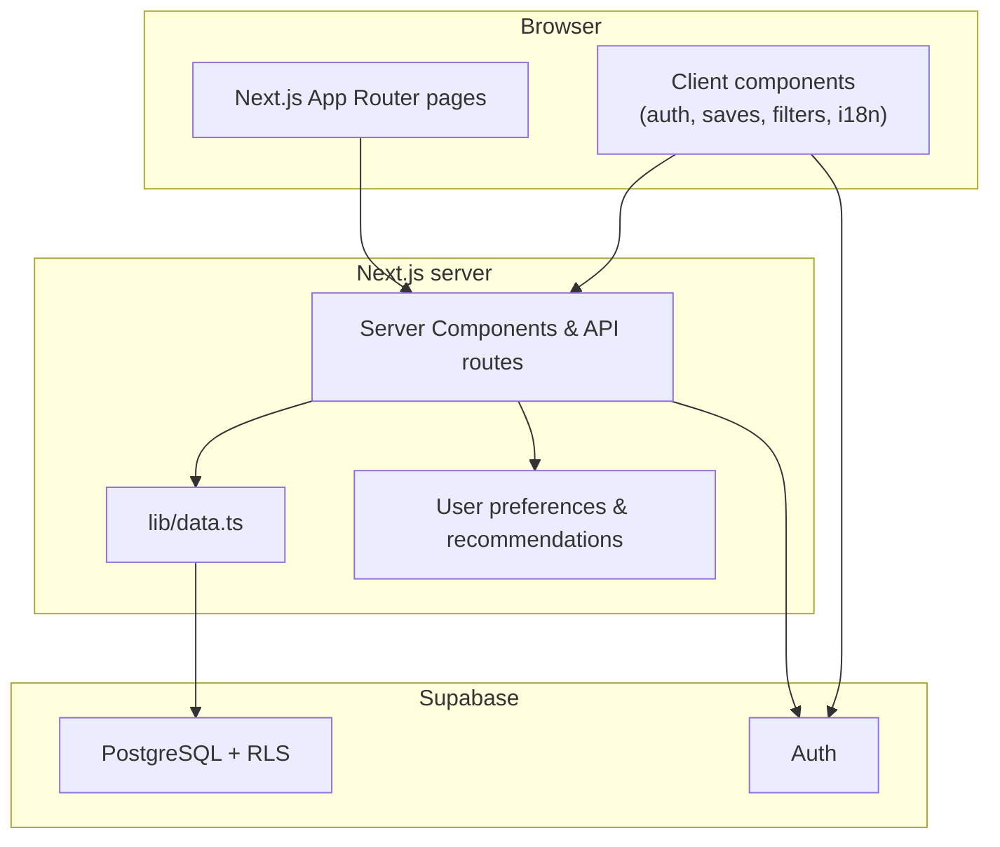
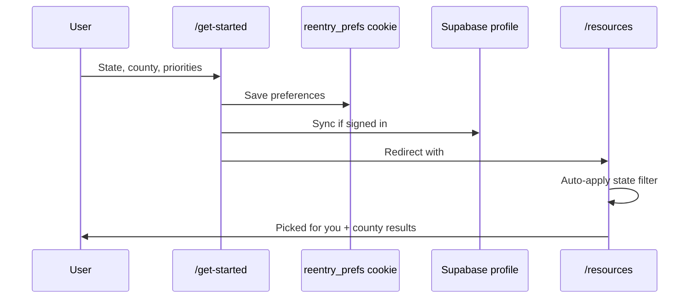

# Reentry Resource Library

**A free, bilingual, accessibility-first directory that helps people coming home from incarceration find housing, jobs, healthcare, legal aid, and other reentry programs — filtered by where they live and what they need most.**

[http://localhost:8080](http://localhost:8080) (local dev) · Next.js 16 · React 19 · Supabase · Tailwind CSS 4

---

> **Maintainers — keep this README current**
>
> Before every **commit** and **push**, update this file if your changes add, remove, or alter:
>
> - User-facing features or flows
> - Routes, API endpoints, or environment variables
> - Database migrations or seed scripts
> - Setup / deployment steps
> - Admin capabilities or facility/tablet auth behavior
>
> Treat `README.md` as part of the definition of done — not optional documentation.

A **pre-commit hook** reminds you when staged changes touch product code but `README.md` is not updated. It runs automatically after `npm install` (`npm run prepare`). Install manually anytime:

```bash
npm run prepare
# or: bash scripts/install-git-hooks.sh
```

To commit without updating the README (emergency only): `git commit --no-verify` or `SKIP_README_HOOK=1 git commit …`.

---

## Table of contents

- [Who this is for](#who-this-is-for)
- [What it does](#what-it-does)
- [How it works](#how-it-works)
- [Feature guide](#feature-guide)
- [Tech stack](#tech-stack)
- [Quick start](#quick-start)
- [Environment variables](#environment-variables)
- [Database setup](#database-setup)
- [Project structure](#project-structure)
- [Routes reference](#routes-reference)
- [Accessibility & design](#accessibility--design)
- [Data & content pipeline](#data--content-pipeline)
- [Further reading](#further-reading)
- [License](#license)

---

## Who this is for

| Audience | How they use the app |
|----------|----------------------|
| **People reentering the community** | Search and filter programs, save favorites, get personalized picks by county and need, email a PDF of saved resources |
| **Family members & supporters** | Browse anonymously or create an account to build and share a resource list |
| **Reentry staff & case managers** | Point clients to vetted programs; future `case_manager` role is schema-ready |
| **Correctional facilities (tablets)** | Facility-scoped accounts via bookmarked entry URL; one account per facility PIN |
| **Program administrators** | Full admin portal for resources, categories, CMS, FAQs, announcements, facilities, and analytics |

The product is built for **clarity under stress**: large touch targets, plain language, bilingual support (English / Spanish), and WCAG-oriented patterns throughout.

---

## What it does

Reentry Resource Library is a **searchable program directory** backed by a curated database of reentry services. Users can:

1. **Discover** resources by keyword, category, state, county, city, service type, and coverage (local, regional, statewide).
2. **Personalize** results by completing a short onboarding flow (state → county → up to three priority needs).
3. **Save** programs to a private list and revisit them from a dashboard.
4. **Share** resource links or email themselves a PDF of saved programs.
5. **Switch language** between English and Spanish at any time.

Administrators maintain all public content — resources, homepage copy, legal pages, FAQs, and facility registry — without redeploying code.

---

## How it works

### High-level architecture



### Data layer

- **`src/lib/data.ts`** — Server-side queries for resources, categories, CMS, FAQs, announcements, and analytics. Falls back to mock data when Supabase is not configured (local demo).
- **Row Level Security** — Public read on active resources; users manage their own saves and views; admins use `is_admin()` policies for management tables.

### Personalization pipeline



**Preference storage**

- Anonymous users: `reentry_prefs` cookie (1 year).
- Signed-in users: merged with `profiles` fields (`state`, `county`, `priority_categories`, `onboarding_completed_at`).
- On login, cookie preferences sync to the profile.

**Recommendations algorithm** (`src/lib/user-preferences/recommendations.ts`)

- Requires completed onboarding (state, county, and at least one priority category).
- Serves only resources in the user’s state that cover their county.
- **Local programs before statewide** within each priority tier.
- **Reserves slots** for each selected priority category when possible.
- Tie-breakers: featured flag, view count, alphabetical name.

### Facility / tablet auth

For jails and facilities that issue tablets:

1. Admin registers a **facility** (name + site ID) in `/admin/facilities`.
2. Tablet bookmark: `/?facility=SITE_ID&pin=FACILITY_PIN` → middleware → `/api/facility/enter`.
3. Inmate creates **one account per (facility, PIN)** at `/facility/signup` with custom security questions (no email verification gate for PDF email).
4. **Session bar** and **inactivity guard** (default 30 min) remind users to sign out on shared devices.
5. Password reset via `/facility/forgot-password` and two security Q&As.

Site IDs are hashed at rest; reversible encryption allows admins to reveal/copy IDs. Requires `FACILITY_CRYPTO_SECRET` and `SUPABASE_SERVICE_ROLE_KEY` for signup/reset APIs.

---

## Feature guide

### Public site

| Feature | Description |
|---------|-------------|
| **Homepage** | Hero search, popular tags, browse-by-category pills, personalized “Picked for you” (when onboarded), How It Works, featured resources, built-for CTA, announcements banner |
| **Resource directory** (`/resources`) | Collapsible location filters, auto state filter from preferences, collapsible “Picked for your needs” section with preference chips and edit link, county-split results (in-county vs statewide), paginated masonry grid |
| **Resource detail** (`/resources/[id]`) | Category/coverage badges, eligibility & operational notes (EN/ES), served counties, contact info, directions, save & share, related resources |
| **Onboarding** (`/get-started`) | 3-step wizard: state (KY/OH) → county → up to 3 priority categories; skip option; edit mode via `?edit=1` |
| **Search & filters** | Keyword, category, state, county, city, service type, coverage, recently added |
| **Saved resources** (`/saved`) | Full saved list (sign-in required) |
| **Dashboard** (`/dashboard`) | Welcome, location & priority summary, saved / recommended / recently viewed sections |
| **Email PDF** | Signed-in users email a PDF of saved resources (Resend) |
| **CMS pages** | About, Contact (form), FAQ (accordion + search), Privacy, Terms, Accessibility |
| **Crisis bar** | Persistent 988 / Crisis Text Line links in the site chrome |
| **Internationalization** | Full EN/ES UI; resource descriptions, eligibility, notes, and CMS content localized; language switcher in header |
| **Breadcrumbs** | Contextual navigation on inner pages |

### Accounts

| Type | Sign up | Notes |
|------|---------|-------|
| **Standard** | `/signup` | Email + password; email confirmation via Supabase |
| **Facility** | `/facility/signup` | Requires active facility session cookie; PIN-bound account |

### Admin portal (`/admin`)

| Section | Capabilities |
|---------|--------------|
| **Analytics** | Most viewed / most saved resources |
| **Resources** | CRUD, featured flag, eligibility/notes (EN/ES), served counties, coverage |
| **Categories** | CRUD with icons and sort order |
| **Facilities** | Register facilities, site ID reveal/copy, signup counts, active toggle |
| **Users** | View users, roles |
| **Homepage** | Hero headline, subheadline, highlight, branding |
| **Site pages** | About, Contact, Privacy, Terms, Accessibility editors |
| **Announcements** | Scheduled homepage banners |
| **FAQs** | Category-grouped questions with EN/ES |

Admin content saved in English can auto-translate to Spanish when `DEEPL_API_KEY` is set.

---

## Tech stack

| Layer | Choice |
|-------|--------|
| Framework | **Next.js 16** (App Router, Server Components, API routes) |
| Language | **TypeScript** |
| UI | **React 19**, **Tailwind CSS 4**, **Lucide** icons |
| Backend | **Supabase** (Auth, PostgreSQL, RLS) |
| Email | **Resend** (saved-resources PDF) |
| Translation (admin) | **DeepL** (optional) |
| PDF generation | **PDFKit** |
| Validation | **Zod** |

---

## Quick start

```bash
git clone <repository-url>
cd "Resource Library"
npm install
cp .env.example .env.local   # then fill in Supabase keys
npm run dev
```

Open **[http://localhost:8080](http://localhost:8080)**.

Production:

```bash
npm run build
npm start
```

---

## Environment variables

Copy `.env.example` to `.env.local` and configure:

| Variable | Required | Purpose |
|----------|----------|---------|
| `NEXT_PUBLIC_SUPABASE_URL` | Yes* | Supabase project URL |
| `NEXT_PUBLIC_SUPABASE_ANON_KEY` | Yes* | Supabase anon key |
| `NEXT_PUBLIC_APP_URL` | Yes | Canonical app URL (auth redirects) |
| `SUPABASE_SERVICE_ROLE_KEY` | Facility auth, bulk seed | Service role for admin Auth APIs and scripts |
| `FACILITY_CRYPTO_SECRET` | Production facilities | HMAC hashing + AES encryption for site IDs / sessions |
| `FACILITY_SESSION_MAX_AGE` | No | Facility session cookie lifetime (seconds, default 8h) |
| `NEXT_PUBLIC_FACILITY_INACTIVITY_MS` | No | Tablet inactivity sign-out prompt (default 30 min) |
| `RESEND_API_KEY` | Email PDF | Resend API key |
| `EMAIL_FROM` | Email PDF | Verified sender address |
| `DEEPL_API_KEY` | No | Auto-translate admin content to Spanish |

\*Without Supabase, the app runs in **mock data mode** for local UI development.

---

## Database setup

Run migrations in order in the Supabase SQL Editor:

```
supabase/migrations/001_initial_schema.sql
supabase/migrations/002_add_description_es.sql
supabase/migrations/003_fix_profile_signup_trigger.sql
supabase/migrations/004_add_eligibility_es_and_notes.sql
supabase/migrations/005_add_served_counties.sql
supabase/migrations/006_add_saved_pdf_emails_sent.sql
supabase/migrations/007_announcement_schedule_rls.sql
supabase/migrations/008_drop_resource_coordinates.sql
supabase/migrations/009_add_profile_onboarding.sql
supabase/migrations/010_facilities_and_auth.sql
```

### Seed resources

```bash
# Kentucky → supabase/seed-resources.sql
npm run seed:resources

# Ohio → supabase/seed-ohio-resources.sql
npm run seed:resources:ohio

# Both
npm run seed:resources:all
```

Run the generated SQL files in Supabase (Kentucky first, then Ohio), or use:

```bash
npm run db:push:ohio   # requires SUPABASE_SERVICE_ROLE_KEY
```

Apply CSV enrichments:

```bash
npm run seed:enrich
```

### Create an admin

1. Sign up via `/signup`.
2. In Supabase SQL:

```sql
UPDATE profiles SET role = 'admin' WHERE email = 'your-admin@example.com';
```

---

## Project structure

```
src/
├── app/                      # Next.js App Router
│   ├── page.tsx              # Homepage
│   ├── resources/            # Directory + detail
│   ├── dashboard/ saved/     # Signed-in user areas
│   ├── get-started/          # Onboarding wizard
│   ├── facility/             # Tablet signup, login, reset
│   ├── admin/                # Admin portal
│   ├── api/                  # Facility, admin, auth, PDF email routes
│   └── about|contact|faq|…   # Public CMS pages
├── components/
│   ├── resources/            # Cards, filters, recommendations, badges
│   ├── onboarding/           # Wizard + prompt banner
│   ├── facility/             # Session bar, inactivity guard, forms
│   ├── admin/                # Sidebar, editors, resource form
│   ├── layout/               # Header, footer, crisis bar, breadcrumbs
│   └── ui/                   # Accessible primitives (buttons, cards, …)
├── i18n/                     # EN/ES messages, locale context, server helpers
├── lib/
│   ├── data.ts               # Data access layer
│   ├── user-preferences/     # Cookie, profile sync, recommendations
│   ├── facility/             # Crypto, session, facility data
│   ├── resource-coverage.ts  # County / statewide logic
│   ├── email/ pdf/           # Saved resources PDF pipeline
│   └── supabase/             # Browser, server, admin clients
├── types/                    # Shared TypeScript types
data/
├── resources.csv             # Source data for Kentucky seed
├── enrichments/              # Batch enrichment JSON
scripts/                      # Seed generators, migrations, enrich apply
supabase/
├── migrations/               # Schema versions
└── seed*.sql                 # Generated seed files
docs/
└── ARCHITECTURE.md           # Deeper technical architecture notes
```

---

## Routes reference

### Public

| Route | Description |
|-------|-------------|
| `/` | Homepage |
| `/resources` | Searchable directory (personalized when onboarded) |
| `/resources/[id]` | Resource detail |
| `/get-started` | Onboarding wizard (`?edit=1` to update preferences) |
| `/dashboard` | User hub (sign-in required) |
| `/saved` | Saved resources list |
| `/login` `/signup` | Standard auth |
| `/about` `/contact` `/faq` | CMS pages |
| `/privacy` `/terms` `/accessibility` | Legal & accessibility |

### Facility (tablet)

| Route | Description |
|-------|-------------|
| `/?facility=…&pin=…` | Facility entry (redirects to enter API) |
| `/facility/signup` | Create PIN-bound account |
| `/facility/login` | Sign in (must match session PIN) |
| `/facility/forgot-password` | Reset via security questions |

### Admin

| Route | Description |
|-------|-------------|
| `/admin` | Analytics dashboard |
| `/admin/resources` | Resource management |
| `/admin/categories` | Categories |
| `/admin/facilities` | Facility registry |
| `/admin/users` | User list |
| `/admin/homepage` | Homepage CMS |
| `/admin/cms` | Site pages hub |
| `/admin/about` `/admin/contact` | Page editors |
| `/admin/legal/[document]` | Privacy, terms, accessibility |
| `/admin/announcements` | Announcements |
| `/admin/faqs` | FAQ management |

---

## Accessibility & design

Built mobile-first with reentry users in mind:

- **18px base font** and high-contrast palette
- **44–48px minimum touch targets** on interactive controls
- **Skip to main content** link
- Semantic HTML, ARIA labels, keyboard-navigable menus and accordions
- `prefers-reduced-motion` respected
- Dedicated [**Accessibility**](/accessibility) statement page (CMS-editable)

Resource cards use a consistent **type badge** system (category, statewide, regional) shared with priority chips in personalized sections.

---

## Data & content pipeline

| Asset | Location | Tooling |
|-------|----------|---------|
| Kentucky resources | `data/resources.csv` | `npm run seed:resources` |
| Ohio resources | `data/ohio-resources.csv` | `npm run seed:resources:ohio` |
| Enrichments | `data/enrichments/batch-*.json` | `npm run seed:enrich` |
| Field semantics | `.cursor/rules/i18n.mdc` | `eligibility` vs `notes` vs `served_counties` |

**Coverage model**

- `single` — one county office / location
- `multi` — listed `served_counties` (pipe-separated in CSV)
- `statewide` — serves entire state

---

## Further reading

- [`docs/ARCHITECTURE.md`](docs/ARCHITECTURE.md) — Database schema, RLS, search implementation, extension points
- [`.cursor/rules/i18n.mdc`](.cursor/rules/i18n.mdc) — i18n conventions for contributors
- [`AGENTS.md`](AGENTS.md) — Agent / Next.js 16 notes for AI-assisted development

---

## License

Private — for authorized reentry program use.
