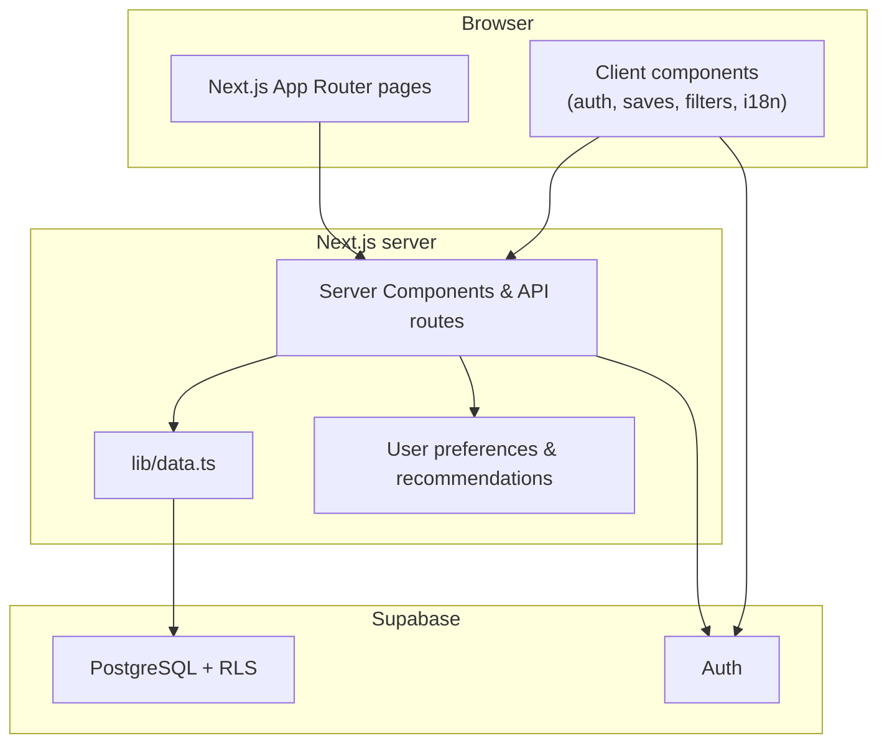
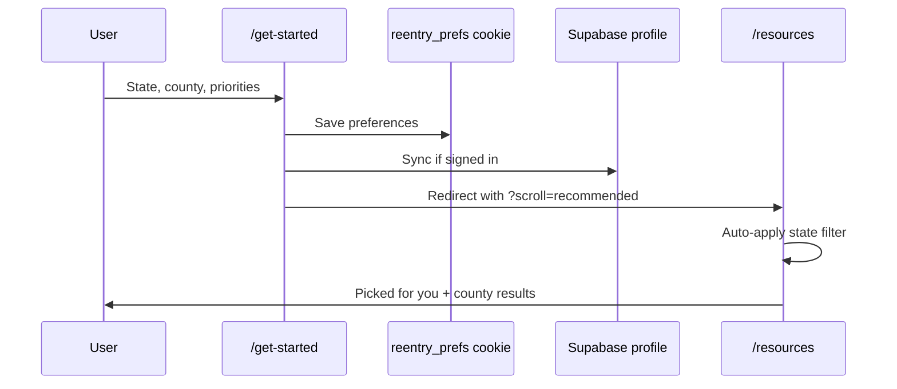

# Reentry Resource Library

**A free, bilingual, accessibility-first directory that helps people coming home from incarceration find housing, jobs, healthcare, legal aid, and other reentry programs — filtered by where they live and what they need most.**

[http://localhost:8080](http://localhost:8080) (local dev) · Next.js 16 · React 19 · Supabase · Tailwind CSS 4

---

> **Maintainers — keep this README current**
>
> Before every **commit** and **push**, update this file if your changes add, remove, or alter:
>
> - User-facing features or flows
> - Routes, API endpoints, or environment variables
> - Database migrations or seed scripts
> - Setup / deployment steps
> - Admin capabilities or facility/tablet auth behavior
>
> Treat `README.md` as part of the definition of done — not optional documentation.

A **pre-commit hook** reminds you when staged changes touch product code but `README.md` is not updated. It runs automatically after `npm install` (`npm run prepare`). Install manually anytime:

```bash
npm run prepare
# or: bash scripts/install-git-hooks.sh
```

To commit without updating the README (emergency only): `git commit --no-verify` or `SKIP_README_HOOK=1 git commit …`.

---

## Table of contents

- [Who this is for](#who-this-is-for)
- [What it does](#what-it-does)
  - [Deployed states (17)](#deployed-states-17)
- [How it works](#how-it-works)
- [Feature guide](#feature-guide)
- [Tech stack](#tech-stack)
- [Quick start](#quick-start)
- [Deploy to Render](#deploy-to-render)
- [Environment variables](#environment-variables)
- [Database setup](#database-setup)
- [Project structure](#project-structure)
- [Routes reference](#routes-reference)
- [Accessibility & design](#accessibility--design)
- [Data & content pipeline](#data--content-pipeline)
- [Further reading](#further-reading)
- [License](#license)

---

## Who this is for

| Audience | How they use the app |
|----------|----------------------|
| **People reentering the community** | Search and filter programs, save favorites, get personalized picks by county and need, email a PDF of saved resources |
| **Family members & supporters** | Browse anonymously or create an account to build and share a resource list |
| **Reentry staff & case managers** | Point clients to vetted programs; future `case_manager` role is schema-ready |
| **Correctional facilities (tablets)** | Facility-scoped accounts via bookmarked entry URL; one account per facility PIN |
| **Program administrators** | Full admin portal for resources, categories, CMS, FAQs, announcements, facilities, and analytics |

The product is built for **clarity under stress**: large touch targets, plain language, bilingual support (English / Spanish), and WCAG-oriented patterns throughout.

---

## What it does

Reentry Resource Library is a **searchable program directory** backed by a curated database of reentry services. Users can:

1. **Discover** resources by keyword, ZIP code, category, state, county, city, service type, and coverage (local, regional, statewide).
2. **Personalize** results by completing a short onboarding flow (state → county → up to three priority needs).
3. **Save** programs to a private list and revisit them from a dashboard.
4. **Share** resource links or email themselves a PDF of saved programs.
5. **Switch language** between English and Spanish at any time.

Administrators maintain all public content — resources, homepage copy, legal pages, FAQs, and facility registry — without redeploying code.

### Deployed states (17)

Onboarding and resource coverage are driven by `src/lib/states/registry.ts`. Each state has a county list under `src/lib/{slug}/counties.ts`, curated CSVs under `data/`, and seed/push npm scripts.

| State | Counties | Resource rows (CSV) | Seed | Push |
|-------|----------|---------------------|------|------|
| Alabama | 67 | 264 | `seed:resources:alabama` | `db:push:alabama` |
| Arizona | 15 | 178 | `seed:resources:arizona` | `db:push:arizona` |
| Florida | 67 | 326 | `seed:resources:florida` | `db:push:florida` |
| Georgia | 159 | 361 | `seed:resources:georgia` | `db:push:georgia` |
| Illinois | 102 | 295 | `seed:resources:illinois` | `db:push:illinois` |
| Indiana | 92 | 314 | `seed:resources:indiana` | `db:push:indiana` |
| Kentucky | 120 | 288 | `seed:resources:kentucky` | `db:push:kentucky` |
| Michigan | 83 | 309 | `seed:resources:michigan` | `db:push:michigan` |
| Mississippi | 82 | 342 | `seed:resources:mississippi` | `db:push:mississippi` |
| North Carolina | 100 | 340 | `seed:resources:north-carolina` | `db:push:north-carolina` |
| Ohio | 88 | 303 | `seed:resources:ohio` | `db:push:ohio` |
| South Carolina | 46 | 230 | `seed:resources:south-carolina` | `db:push:south-carolina` |
| Tennessee | 95 | 298 | `seed:resources:tennessee` | `db:push:tennessee` |
| Texas | 254 | 886 | `seed:resources:texas` | `db:push:texas` |
| Virginia | 133 | 299 | `seed:resources:virginia` | `db:push:virginia` |
| West Virginia | 55 | 252 | `seed:resources:west-virginia` | `db:push:west-virginia` |
| Wisconsin | 72 | 340 | `seed:resources:wisconsin` | `db:push:wisconsin` |

Row counts come from `data/{slug}-resources.csv` and change when you rebuild a state’s pipeline. Research prompts live in `docs/prompts/{slug}-resource-research.md`.

---

## How it works

### High-level architecture


```mermaid
flowchart TB
  subgraph Client["Browser"]
    Pages["Next.js App Router pages"]
    ClientUI["Client components<br/>(auth, saves, filters, i18n)"]
  end

  subgraph Server["Next.js server"]
    RSC["Server Components & API routes"]
    Data["lib/data.ts"]
    Prefs["User preferences & recommendations"]
  end

  subgraph Backend["Supabase"]
    Auth["Auth"]
    DB["PostgreSQL + RLS"]
  end

  Pages --> RSC
  ClientUI --> RSC
  RSC --> Data
  RSC --> Prefs
  Data --> DB
  ClientUI --> Auth
  RSC --> Auth
```

### Data layer

- **`src/lib/data.ts`** — Server-side queries for resources, categories, CMS, FAQs, announcements, and analytics. Falls back to mock data when Supabase is not configured (local demo).
- **Row Level Security** — Public read on active resources; users manage their own saves and views; admins use `is_admin()` policies for management tables.

### Personalization pipeline


```mermaid
sequenceDiagram
  participant User
  participant Wizard as /get-started
  participant Cookie as reentry_prefs cookie
  participant Profile as Supabase profile
  participant Page as /resources

  User->>Wizard: State, county, priorities
  Wizard->>Cookie: Save preferences
  Wizard->>Profile: Sync if signed in
  Wizard->>Page: Redirect with ?scroll=recommended
  Page->>Page: Auto-apply state filter
  Page->>User: Picked for you + county results
```

**Preference storage**

- Anonymous users: `reentry_prefs` cookie (1 year).
- Signed-in users: merged with `profiles` fields (`state`, `county`, `priority_categories`, `onboarding_completed_at`).
- On login, cookie preferences sync to the profile.

**Recommendations algorithm** (`src/lib/user-preferences/recommendations.ts`)

- Requires completed onboarding (state, county, and at least one priority category).
- Serves only resources in the user’s state that cover their county.
- **Local programs before statewide** within each priority tier.
- **Reserves slots** for each selected priority category when possible.
- Tie-breakers: featured flag, view count, alphabetical name.

### Facility / tablet auth

For jails and facilities that issue tablets:

1. Admin registers a **facility** (name + site ID) in `/admin/facilities`.
2. Tablet bookmark: `/?facility=SITE_ID&pin=FACILITY_PIN` → middleware → `/api/facility/enter`.
3. Inmate creates **one account per (facility, PIN)** at `/facility/signup` with custom security questions (no email verification gate for PDF email).
4. **Session bar** and **inactivity guard** (default 30 min) remind users to sign out on shared devices.
5. **Password reset** at `/facility/forgot-password`: enter PIN → answer security questions → set a new password (with strength meter and confirm field).
6. **Sign-up and reset** use show/hide password toggles, confirm-password fields, and a strength meter.
7. Returning users at `/facility/login` see a masked PIN on the shared device; only the password is entered.

Site IDs are hashed at rest; reversible encryption allows admins to reveal/copy IDs. Requires `FACILITY_CRYPTO_SECRET` and `SUPABASE_SERVICE_ROLE_KEY` for signup/reset APIs.

---

## Feature guide

### Public site

| Feature | Description |
|---------|-------------|
| **Homepage** | Hero search, popular tags, browse-by-category pills, personalized “Picked for you” (when onboarded), How It Works, featured resources, built-for CTA, announcements banner |
| **Resource directory** (`/resources`) | Hero search with separate collapsible location filters (collapsed by default); filters and intake signals apply when the user presses **Search** (no auto-scroll on every change), sticky search bar, server-rendered initial results, “Resources based on your chosen needs” section with dashboard link to edit preferences, county/statewide or ZIP/nearby/statewide split with count badges in section headers, paginated stable-column masonry grid with scroll-triggered card reveals; `?scroll=results` or `?scroll=recommended` for deep links from homepage and dashboard |
| **Homepage** (`/`) | Scroll-triggered section reveals; featured and recommended resource cards animate individually |
| **Resource detail** (`/resources/[id]`) | Category/coverage badges, intake signal badges (criminal record, referral, walk-in), eligibility & operational notes (EN/ES), served counties, contact info, directions, save & share, related resources, library disclaimer bar at page bottom |
| **Onboarding** (`/get-started`) | 3-step wizard: state (from registry) → county → up to 3 priority categories; skip option; edit mode via `?edit=1` |
| **Search & filters** | Keyword or 5-digit ZIP (optional keyword after ZIP, e.g. `40202 housing`), category, state, county, city, service type, coverage, recently added, intake signals (`?intake=accepts_criminal_record\|walk_in_ok` — AND logic); draft filter state until **Search** is pressed |
| **Saved resources** (`/saved`) | Full saved list (sign-in required) |
| **Dashboard** (`/dashboard`) | Welcome, location & priority summary, saved / recommended / recently viewed sections |
| **Email PDF** | Signed-in users email a PDF of saved resources (Resend); sidebar sections (contact, counties served) spaced correctly in the layout |
| **CMS pages** | About, Contact (form), FAQ (accordion + search), Privacy, Terms, Accessibility |
| **Crisis bar** | Persistent 988 / Crisis Text Line links in the site chrome |
| **Library disclaimer** | Footer and full-width info bar on `/resources` and resource detail pages clarifying Road to Reentry is a directory, not a service provider (EN/ES) |
| **Internationalization** | Full EN/ES UI; resource descriptions, eligibility, notes, and CMS content localized; language switcher in header |
| **Breadcrumbs** | Contextual navigation on inner pages |

### Accounts

| Type | Sign up | Notes |
|------|---------|-------|
| **Standard** | `/signup` | Email + password with strength meter and confirm field; email confirmation via Supabase |
| **Facility** | `/facility/signup` | Requires active facility session cookie; PIN-bound account; optional contact email; password strength + confirm |

### Admin portal (`/admin`)

| Section | Capabilities |
|---------|--------------|
| **Analytics** | Most viewed / most saved resources |
| **Resources** | CRUD, featured flag, eligibility/notes (EN/ES), served counties, coverage, intake signal tags; filter by state and category; paginated fetch (no 1,000-row cap) |
| **Categories** | CRUD with icons and sort order |
| **Facilities** | Register facilities, site ID reveal/copy, signup counts, active toggle |
| **Users** | View users, reset passwords, delete accounts, read saved-resource counts |
| **Homepage** | Hero headline, subheadline, highlight, branding |
| **Site pages** | About, Contact, Privacy, Terms, Accessibility editors |
| **Announcements** | Scheduled homepage banners |
| **FAQs** | Category-grouped questions with EN/ES |

Admin content saved in English can auto-translate to Spanish when `DEEPL_API_KEY` is set.

---

## Tech stack

| Layer | Choice |
|-------|--------|
| Framework | **Next.js 16** (App Router, Server Components, API routes) |
| Language | **TypeScript** |
| UI | **React 19**, **Tailwind CSS 4**, **Lucide** icons |
| Backend | **Supabase** (Auth, PostgreSQL, RLS) |
| Email | **Resend** (saved-resources PDF) |
| Translation (admin) | **DeepL** (optional) |
| PDF generation | **PDFKit** |
| Validation | **Zod** |

---

## Quick start

```bash
git clone <repository-url>
cd "Resource Library"
npm install
cp .env.example .env.local   # then fill in Supabase keys
npm run dev
```

Open **[http://localhost:8080](http://localhost:8080)**.

Production locally:

```bash
npm run build
npm start
```

---

## Deploy to Render

This app is a **Node Web Service** (SSR + API routes), not a static site. Blueprint: [`render.yaml`](render.yaml).

### 1. Push deploy config

Commit and push `render.yaml`, the `start` script that binds to `$PORT`, and `.node-version` to `main` (Render builds from GitHub).

### 2. Create the service

**Option A — Blueprint**

1. Open [Render Dashboard](https://dashboard.render.com) → **New** → **Blueprint**.
2. Connect `anthonyash91/r2r-resource-library` (or your fork) and select branch `main`.
3. Apply the Blueprint. It creates `r2r-resource-library` with `npm ci && npm run build` / `npm start`.

**Option B — Manual Web Service**

| Setting | Value |
|---------|--------|
| Runtime | Node |
| Branch | `main` |
| Build command | `npm ci && npm run build` |
| Start command | `npm start` |
| Instance | Free (or Starter if the free tier spins down too often) |

### 3. Set environment variables

In the service **Environment** tab (or Blueprint sync prompts), set:

| Variable | Required | Notes |
|----------|----------|--------|
| `NEXT_PUBLIC_SUPABASE_URL` | Yes | Same as local `.env.local` |
| `NEXT_PUBLIC_SUPABASE_ANON_KEY` | Yes | Supabase anon key |
| `NEXT_PUBLIC_APP_URL` | Yes | Your Render URL, e.g. `https://r2r-resource-library.onrender.com` (no trailing slash) |
| `SUPABASE_SERVICE_ROLE_KEY` | Facility / admin scripts | Keep secret; never expose to the browser |
| `FACILITY_CRYPTO_SECRET` | Production facilities | Long random string |
| `RESEND_API_KEY` / `EMAIL_FROM` | Email PDF | Optional |
| `DEEPL_API_KEY` | Admin auto-translate | Optional |

`NODE_VERSION` is set to `22.22.0` via Blueprint / `.node-version`. Render injects `PORT`; `npm start` binds to it.

### 4. Supabase auth allowlist

In Supabase → **Authentication** → **URL configuration**:

- **Site URL:** your Render URL
- **Redirect URLs:** add `https://YOUR-SERVICE.onrender.com/**` (and keep localhost for local dev)

### 5. Data on production

Render only runs the Next.js app. Resource rows live in **Supabase**. After deploy, seed/push from your machine (with production keys) if the project is empty:

```bash
# Example for one state — use production SUPABASE_* in .env.local carefully
npm run db:push:kentucky
# …or each state's db:push:* / seed SQL in the Supabase SQL Editor
```

### 6. Verify

1. Open the Render URL — homepage loads.
2. `/resources` returns live data (not empty mock mode).
3. Sign-up / login redirects stay on your Render host.
4. Free tier sleeps after idle; first request can take ~30–60s.

Build note: `npm run build` runs `generate:us-map` (needs **Python 3** + outbound network). Render’s Node image includes Python 3.

---

## Environment variables

Copy `.env.example` to `.env.local` and configure:

| Variable | Required | Purpose |
|----------|----------|---------|
| `NEXT_PUBLIC_SUPABASE_URL` | Yes* | Supabase project URL |
| `NEXT_PUBLIC_SUPABASE_ANON_KEY` | Yes* | Supabase anon key |
| `NEXT_PUBLIC_APP_URL` | Yes | Canonical app URL (auth redirects) |
| `SUPABASE_SERVICE_ROLE_KEY` | Facility auth, bulk seed | Service role for admin Auth APIs and scripts |
| `FACILITY_CRYPTO_SECRET` | Production facilities | HMAC hashing + AES encryption for site IDs / sessions |
| `FACILITY_SESSION_MAX_AGE` | No | Facility session cookie lifetime (seconds, default 8h) |
| `NEXT_PUBLIC_FACILITY_INACTIVITY_MS` | No | Tablet inactivity sign-out prompt (default 30 min) |
| `RESEND_API_KEY` | Email PDF | Resend API key |
| `EMAIL_FROM` | Email PDF | Verified sender address |
| `DEEPL_API_KEY` | No | Auto-translate admin content to Spanish |

\*Without Supabase, the app runs in **mock data mode** for local UI development.

---

## Database setup

Run migrations in order in the Supabase SQL Editor:

```
supabase/migrations/001_initial_schema.sql
supabase/migrations/002_add_description_es.sql
supabase/migrations/003_fix_profile_signup_trigger.sql
supabase/migrations/004_add_eligibility_es_and_notes.sql
supabase/migrations/005_add_served_counties.sql
supabase/migrations/006_add_saved_pdf_emails_sent.sql
supabase/migrations/007_announcement_schedule_rls.sql
supabase/migrations/008_drop_resource_coordinates.sql
supabase/migrations/009_add_profile_onboarding.sql
supabase/migrations/010_facilities_and_auth.sql
supabase/migrations/011_admin_read_saved_resources.sql
supabase/migrations/012_facility_contact_email.sql
supabase/migrations/013_admin_delete_user.sql
supabase/migrations/014_add_intake_signals.sql
```

### Seed resources

Each state script builds/enriches the CSV (when applicable), writes `supabase/seed-{slug}-resources.sql`, and uses a dedicated UUID prefix. Per-state commands:

```bash
npm run seed:resources:kentucky
npm run seed:resources:ohio
npm run seed:resources:indiana
npm run seed:resources:tennessee
npm run seed:resources:michigan
npm run seed:resources:illinois
npm run seed:resources:west-virginia
npm run seed:resources:georgia
npm run seed:resources:north-carolina
npm run seed:resources:virginia
npm run seed:resources:south-carolina
npm run seed:resources:alabama
npm run seed:resources:arizona
npm run seed:resources:florida
npm run seed:resources:mississippi
npm run seed:resources:wisconsin
npm run seed:resources:texas

# All 17 states (also regenerates US map data from the state registry)
npm run seed:resources:all
```

`npm run build` runs `generate:us-map` automatically so the homepage coverage map reflects states in `src/lib/states/registry.ts`.

Run the generated SQL files in Supabase, or upsert from CSV with a service role key:

```bash
npm run db:push:kentucky   # requires SUPABASE_SERVICE_ROLE_KEY
npm run db:push:ohio
npm run db:push:indiana
npm run db:push:tennessee
npm run db:push:michigan
npm run db:push:illinois
npm run db:push:west-virginia
npm run db:push:georgia
npm run db:push:north-carolina
npm run db:push:virginia
npm run db:push:south-carolina
npm run db:push:alabama
npm run db:push:arizona
npm run db:push:florida
npm run db:push:mississippi
npm run db:push:wisconsin
npm run db:push:texas
```

Apply CSV enrichments (also auto-tags `intake_signals` from eligibility/notes):

```bash
npm run seed:enrich            # merge batch JSON → CSV + refresh intake signals
npm run enrich:kentucky
npm run enrich:ohio
npm run enrich:indiana
npm run enrich:tennessee
npm run enrich:michigan
npm run enrich:illinois
npm run enrich:west-virginia
npm run enrich:georgia
npm run enrich:north-carolina
npm run enrich:virginia
npm run enrich:south-carolina
npm run enrich:alabama
npm run enrich:arizona
npm run enrich:florida
npm run enrich:mississippi
npm run enrich:wisconsin
npm run enrich:texas
```

`python3 scripts/enrich-resources.py` expands descriptions and **sets `intake_signals`** on every row (heuristic). Optional LLM refinement afterward:

```bash
npm run tag:intake:dry   # preview heuristic-only re-tag
npm run tag:intake:llm   # Claude/OpenAI second pass
```

Push tags to Supabase after CSV changes:

```bash
npm run db:push:intake
```

Optional LLM-only pass (API key required — not included with Claude.ai web subscription):

```bash
export ANTHROPIC_API_KEY=sk-ant-...   # from console.anthropic.com
npx tsx scripts/tag-intake-signals.ts data/kentucky-resources.csv --llm
# or: --llm-provider=openai with OPENAI_API_KEY
```

Default heuristic tagging (`npm run tag:intake`) is free and runs across all deployed state CSVs.

Push tags to Supabase after tagging or LLM pass:

```bash
npm run db:push:intake
```

### Create an admin

1. Sign up via `/signup`.
2. In Supabase SQL:

```sql
UPDATE profiles SET role = 'admin' WHERE email = 'your-admin@example.com';
```

---

## Project structure

```
src/
├── app/                      # Next.js App Router
│   ├── page.tsx              # Homepage
│   ├── resources/            # Directory + detail
│   ├── dashboard/ saved/     # Signed-in user areas
│   ├── get-started/          # Onboarding wizard
│   ├── facility/             # Tablet signup, login, reset
│   ├── admin/                # Admin portal
│   ├── api/                  # Facility, admin, auth, PDF email routes
│   └── about|contact|faq|…   # Public CMS pages
├── components/
│   ├── resources/            # Cards, filters, recommendations, badges
│   ├── onboarding/           # Wizard + prompt banner
│   ├── facility/             # Session bar, inactivity guard, forms
│   ├── admin/                # Sidebar, editors, resource form
│   ├── layout/               # Header, footer, crisis bar, breadcrumbs
│   └── ui/                   # Accessible primitives (buttons, cards, …)
├── i18n/                     # EN/ES messages, locale context, server helpers
├── lib/
│   ├── data.ts               # Data access layer
│   ├── states/registry.ts    # Deployed onboarding states (17)
│   ├── {state}/counties.ts   # Canonical county lists per state
│   ├── user-preferences/     # Cookie, profile sync, recommendations
│   ├── facility/             # Crypto, session, facility data
│   ├── resource-coverage.ts  # County / statewide logic
│   ├── email/ pdf/           # Saved resources PDF pipeline
│   └── supabase/             # Browser, server, admin clients
├── types/                    # Shared TypeScript types
data/
├── {state}-resources.csv     # Curated resources (one CSV per deployed state)
├── {state}-research-log.csv  # Source / confidence log per state
├── enrichments/              # Per-state enrichment JSON audits
scripts/                      # Build, sync, enrich, seed, and push pipelines
supabase/
├── migrations/               # Schema versions
└── seed-*-resources.sql      # Generated seed files per state
docs/
├── ARCHITECTURE.md           # Deeper technical architecture notes
└── prompts/                  # Per-state resource research overlays
```

---

## Routes reference

### Public

| Route | Description |
|-------|-------------|
| `/` | Homepage |
| `/resources` | Searchable directory (personalized when onboarded) |
| `/resources/[id]` | Resource detail |
| `/get-started` | Onboarding wizard (`?edit=1` to update preferences) |
| `/dashboard` | User hub (sign-in required) |
| `/saved` | Saved resources list |
| `/login` `/signup` | Standard auth |
| `/about` `/contact` `/faq` | CMS pages |
| `/privacy` `/terms` `/accessibility` | Legal & accessibility |

### Facility (tablet)

| Route | Description |
|-------|-------------|
| `/?facility=…&pin=…` | Facility entry (redirects to enter API) |
| `/facility/signup` | Create PIN-bound account |
| `/facility/login` | Sign in (must match session PIN) |
| `/facility/forgot-password` | Reset via PIN, then security questions, then new password |

### Admin

| Route | Description |
|-------|-------------|
| `/admin` | Analytics dashboard |
| `/admin/resources` | Resource management |
| `/admin/categories` | Categories |
| `/admin/facilities` | Facility registry |
| `/admin/users` | User list |
| `/admin/homepage` | Homepage CMS |
| `/admin/cms` | Site pages hub |
| `/admin/about` `/admin/contact` | Page editors |
| `/admin/legal/[document]` | Privacy, terms, accessibility |
| `/admin/announcements` | Announcements |
| `/admin/faqs` | FAQ management |

---

## Accessibility & design

Built mobile-first with reentry users in mind:

- **18px base font** and high-contrast palette
- **44–48px minimum touch targets** on interactive controls
- **Skip to main content** link
- Semantic HTML, ARIA labels, keyboard-navigable menus and accordions
- `prefers-reduced-motion` respected
- Dedicated [**Accessibility**](/accessibility) statement page (CMS-editable)
- Marketing and content pages alternate **white** and **light gray** (`#f9fafb`) full-width section bands between the header hero and footer hero (crisis bar unchanged)

Resource cards use a consistent **type badge** system (category, statewide, regional) shared with priority chips in personalized sections.

---

## Data & content pipeline

| Asset | Location | Tooling |
|-------|----------|---------|
| State registry | `src/lib/states/registry.ts` | Onboarding + map coverage source of truth |
| County lists | `src/lib/{slug}/counties.ts` | Filters / validation |
| Resources (17 states) | `data/{slug}-resources.csv` | `npm run seed:resources:{slug}` |
| Research logs | `data/{slug}-research-log.csv` | Generated with each state's build script |
| Research prompts | `docs/prompts/{slug}-resource-research.md` | Overlay on `multi-state-resource-research.md` |
| County benefits sync | `scripts/data/*-offices.json` | `python3 scripts/sync-county-benefits-offices.py --state {slug}` |
| Enrichments | `data/enrichments/{slug}-enriched.json` | `npm run enrich:{slug}` |
| US coverage map | `src/lib/us-map/county-centroids.generated.ts` | `npm run generate:us-map` (also on `npm run build`) |
| Field semantics | `.cursor/rules/i18n.mdc` | `eligibility` vs `notes` vs `served_counties` |

**Coverage model**

- `single` — one county office / location
- `multi` — listed `served_counties` (pipe-separated in CSV)
- `statewide` — serves entire state

**Adding a state**

1. Add `src/lib/{slug}/counties.ts` and register it in `src/lib/states/registry.ts`.
2. Add EN/ES keys under `onboarding.states` and `pathways.firstWeek.introByState`.
3. Follow `docs/prompts/multi-state-resource-research.md` plus a state overlay under `docs/prompts/`.
4. Wire `seed:resources:{slug}`, `enrich:{slug}`, and `db:push:{slug}` in `package.json`, then include the slug in `seed:resources:all`.

---

## Further reading

- [`docs/ARCHITECTURE.md`](docs/ARCHITECTURE.md) — Database schema, RLS, search implementation, extension points
- [`.cursor/rules/i18n.mdc`](.cursor/rules/i18n.mdc) — i18n conventions for contributors
- [`AGENTS.md`](AGENTS.md) — Agent / Next.js 16 notes for AI-assisted development

---

## License

Private — for authorized reentry program use.
